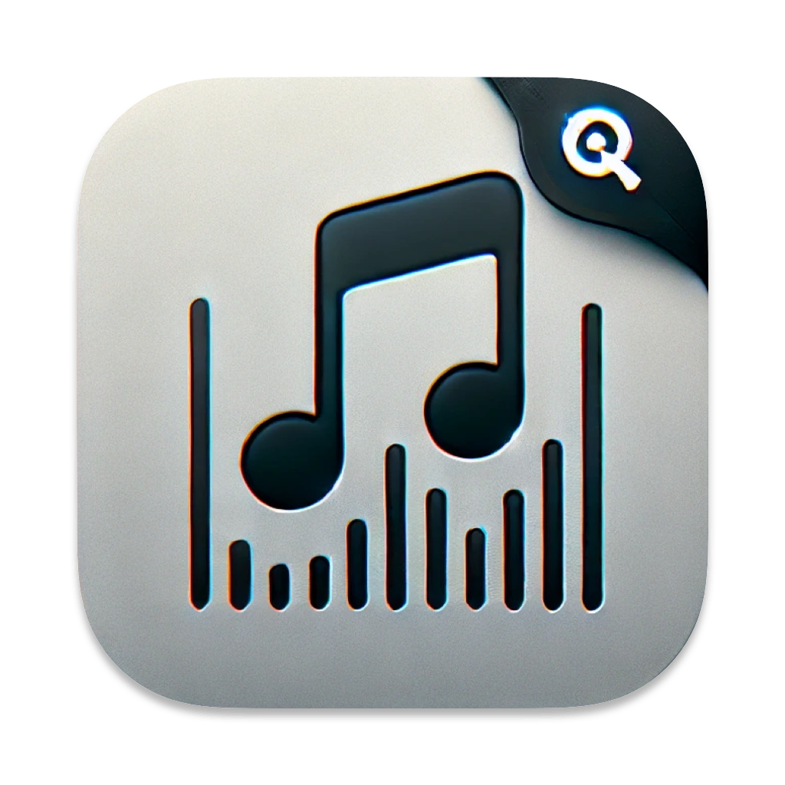

<div align="center">
  
  <h1>AudioTag</h1>
  <p>Audio metadata editor for macOS powered by TagLib<br /></p>

[](https://www.gnu.org/licenses/agpl-3.0.en.html)

</div>


## Features

- Native user interface built with [SwiftUI](https://developer.apple.com/xcode/swiftui/).

## Requirements

- macOS 14.0 (or newer)
- Xcode 16.0 (or newer)

## Building

### Get the Code

```bash
git clone https://github.com/foyoodo/AudioTag.git
```

### Install [Tuist](https://github.com/tuist/tuist)

#### [Mise](https://github.com/jdx/mise) (Recommended)

Install Mise (Optional)

```bash
brew install mise
```

Open the project folder in your terminal, then

```bash
mise install
```

#### Homebrew

```bash
brew install tuist@x.xx.x # version in .mise.toml
```

### Generate .xcworkspace file

```bas
tuist install
tuist generate --no-binary-cache
```

### Build and Run

<kbd>⌘ Command</kbd> + <kbd>R</kbd>

## License

AudioTag and its components is shared on [AGPL v3](https://www.gnu.org/licenses/agpl-3.0.en.html) license.
