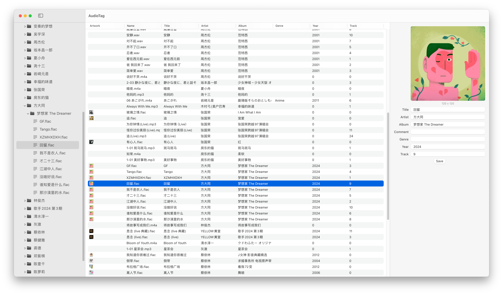

# AudioTag

AudioTag is an audio metadata editor for macOS powered by TagLib.

## Preview



## Features

- Native user interface built with [SwiftUI](https://developer.apple.com/xcode/swiftui/).

## Requirements

- macOS 14.0 (or newer)
- Xcode 15.4 (or newer)

## Building

### Get the Code

```bash
git clone https://github.com/foyoodo/AudioTag.git
```

### Install [Mise](https://github.com/jdx/mise) (Recommended)

#### Homebrew

```bash
brew install mise
```

### Install Tuist

#### Mise (Optional)

Open the project folder in your terminal, then

```bash
mise install
```

#### Homebrew

```bash
brew install tuist@x.xx.x # version in .mise.toml
```

### Generate .xcworkspace file

```bas
tuist install
tuist generate --no-binary-cache
```

### Build and Run

Command+R
